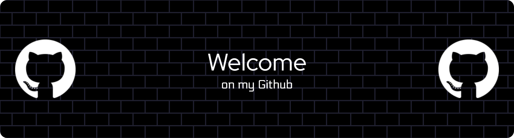

 

  

<h1 align="center">🌙 Sarah — Backend Developer</h1>

  <em>Building quiet systems that do loud things.</em>

  
  
  

---

### 🪴 About Me  
- 🧠 Backend developer who loves exploring new tech stacks </li>
- 🧩 Constantly learning, refactoring and simplifying</li>
- 💡 Scalability, clean code, continuous improvement</li>

---

### 🔧 Tech Universe 

  

---

### 💻 Currently Exploring
- 📦 Creating open-source packages
- 🗂️ Domain-Driven Design (DDD)
- ⚙️ CI/CD pipelines

---

### 📫 Contact Me  

📍 Based in Lyon, France  

💼 [LinkedIn — Sarah Tahar](https://www.linkedin.com/in/sarah-tahar)  

🌐 [GitHub — @Sarah-THR](https://github.com/Sarah-THR) 